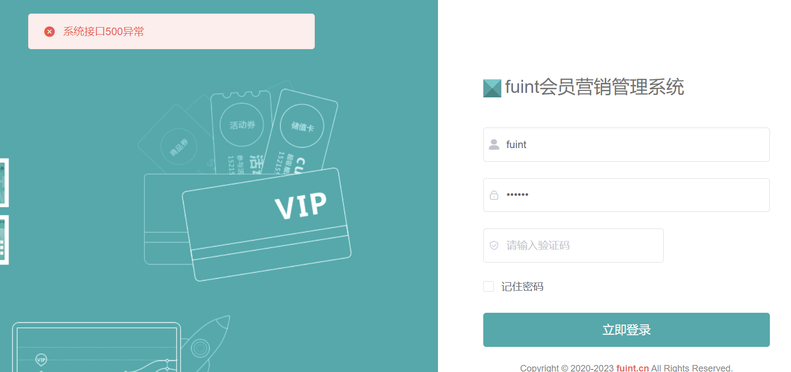
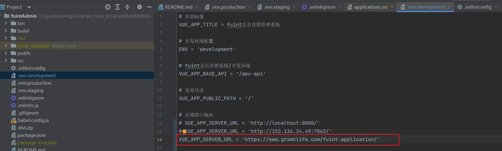
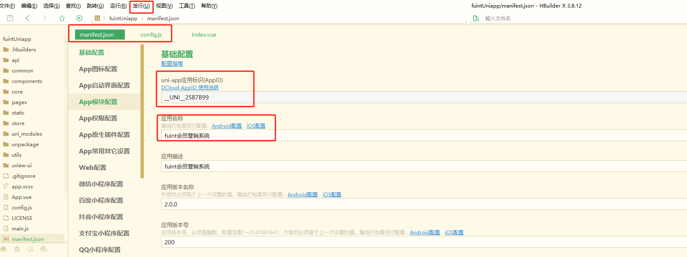
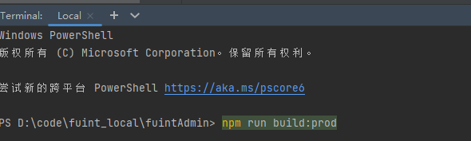
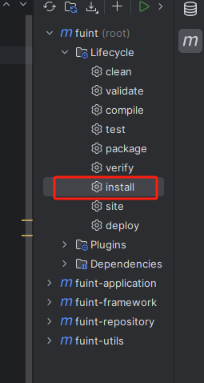
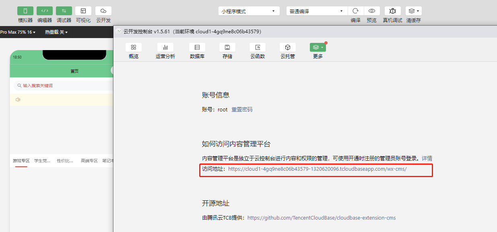
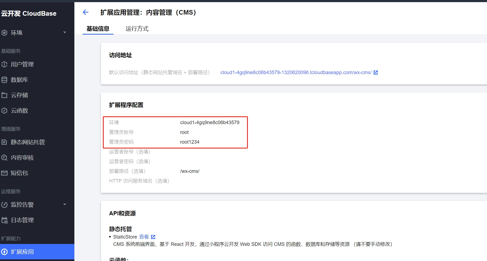

# 问题

Proxy error: Could not proxy request /clientApi/captcha/getCode from localhost:81 to http://localhost:8080/.
See https://nodejs.org/api/errors.html#errors_common_system_errors for more information (ECONNREFUSED).



解决：




天鑫商盟运营小程序使用指南


店铺地址需要输入经纬度：
腾讯地图经纬度查询：[https://lbs.qq.com/tool/getpoint/index.html](https://cloud.tencent.com/developer/tools/blog-entry?target=https%3A%2F%2Flbs.qq.com%2Ftool%2Fgetpoint%2Findex.html&source=article&objectId=1801009)
纬度在前，经度在后


# 腾讯云服务器环境配置








https://developers.weixin.qq.com/doc/offiaccount/Cards_and_Offer/Create_a_Coupon_Voucher_or_Card.html


# 会员管理系统

## 准备

1、一台服务器，2核4G以上配置，可购买腾讯云轻量应用服务器；（必备）  

https://console.cloud.tencent.com/lighthouse/instance/index?rid=1
2、注册并备案一个域名，可以是二级域名；（必备）	

https://console.cloud.tencent.com/domain/all-domain/all

域名备案：https://cloud.tencent.com/product/ba

3、注册一个微信小程序，提供appid、appScret；（微信小程序，选备）  

appid： wx0fbb90366f11e69a

appsrect： daad38f55c58d2598567e7f45f10cc89

4、注册微信支付商户号，提供商户号、支付秘钥；（微信支付用，选备）

https://pay.weixin.qq.com/index.php/core/info

695765222269576522226957652222Gt


# CMS内容管理平台



腾讯云控制台： https://console.cloud.tencent.com/tcb/extensions/detail?envId=cloud1-4gq9ne8c06b43579&rid=4&extensionId=wx-ext-cms-nNH1XOhA&showBackBtn=true



商城小程序

https://cloud1-4gq9ne8c06b43579-1320620096.tcloudbaseapp.com/wx-cms/#/project/content/0ab5303b62d105840e8a4a383ac2ec66?current=1&pageSize=10&pid=6dccf91664fc08020000d68b52c427a1


## 微信云托管

https://cloud.weixin.qq.com/cloudrun/console

域名地址

[https://springboot-ou3z-70143-4-1320620096.sh.run.tcloudbase.com](https://springboot-ou3z-70143-4-1320620096.sh.run.tcloudbase.com/)

小程序/公众号中调用

```
wx.cloud.callContainer({
  "config": {
    "env": "prod-8gr3i5xxaac3fbe6"
  },
  "path": "/api/count",
  "header": {
    "X-WX-SERVICE": "springboot-ou3z"
  },
  "method": "POST",
  "data": {
    "action": "inc"
  }
})
```

```
账号
root
密码
kESFa37K
```

代码复制完成，你可以进行以下操作进行二次开发：

从 Git 上拉取仓库

```
git clone https://github.com/guotianping/wx_cloud_server.git
```

修改代码，并提交到 Git 仓库上触发流水线更新

```
git commit -m 'update' && git push -u origin master
```

### DMS数据库管理

https://dms.cloud.tencent.com/v3/mysql/index.html#/dataEditor?db=springboot_demo&table=Counters